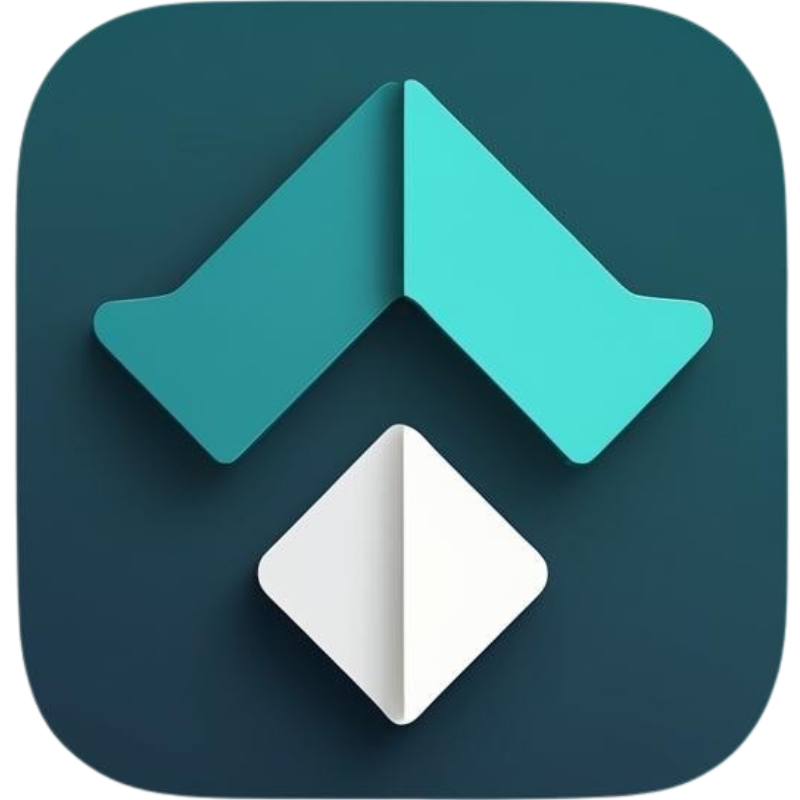

<p align="center">
  
</p>

<h1 align="center">InTune</h1>

<p align="center">
  <strong>🚀 Ultra-fast local file transfer & remote control between Android and Windows</strong>
</p>

<p align="center">
  <a href="#-features">Features</a> •
  <a href="#-installation">Installation</a> •
  <a href="#-quick-start">Quick Start</a> •
  <a href="#-user-guide">User Guide</a> •
  <a href="#-troubleshooting">Troubleshooting</a>
</p>

<p align="center">
  
  
  
</p>

---

## 📖 About

**InTune** is a powerful, local-first connectivity suite that enables seamless communication between your Android phone and Windows PC over WiFi. Transfer files at LAN speeds, control your PC remotely, sync clipboards, and more — all without requiring an internet connection!

Built with Flutter, InTune delivers a native experience on both platforms with a modern, premium dark-themed interface.

---

## ✨ Features

### 📁 File Transfer

| Feature | Description |
|---------|-------------|
| **High-Speed Transfer** | Transfer files at full LAN speeds (100+ Mbps on good networks) |
| **Drag & Drop** | Simply drag files onto the Windows app to send to Android |
| **Folder Transfer** | Send entire folders with preserved directory structure |
| **Multi-File Support** | Select and send multiple files at once |
| **Context Menu Integration** | Right-click any file on Windows → "Send with InTune" |
| **Transfer History** | Track all sent and received files with detailed logs |
| **Progress Tracking** | Real-time progress with speed indicators |

### 📋 Universal Clipboard

| Feature | Description |
|---------|-------------|
| **Bi-directional Sync** | Copy on one device, paste on the other |
| **Manual Sync** | Push or pull clipboard content on demand |
| **Auto Sync** | Automatic clipboard sync every 2 seconds (optional) |

### 🎮 Remote Control

| Feature | Description |
|---------|-------------|
| **Trackpad** | Control your PC cursor from your phone |
| **Keyboard** | Type on PC using your phone's keyboard |
| **Adjustable Sensitivity** | Fine-tune cursor speed (0.5x - 3.0x) |
| **Quick Actions** | Mute, Task View, Close Window buttons |

### 📱 Phone Storage Access

| Feature | Description |
|---------|-------------|
| **Remote File Browser** | Browse your phone's storage from Windows |
| **Download Files** | Download files from phone to PC |
| **File Thumbnails** | Preview images and videos before downloading |

### 💻 Windows Integration

| Feature | Description |
|---------|-------------|
| **System Tray** | Runs quietly in the background |
| **Launch at Startup** | Optional auto-start with Windows |
| **Context Menu** | Right-click to send files directly |
| **Minimize to Tray** | Closes to tray instead of exiting |

---

## 📥 Installation

### 📱 Android

1. Download **[InTune_Android_v1.0.apk](./releases/InTune_Android_v1.0.apk)** from the releases folder
2. Transfer to your Android device (or download directly)
3. Enable **"Install from Unknown Sources"** in Settings if prompted
4. Tap the APK file to install
5. Open InTune and grant the required permissions:
   - **Storage** - Required for sending and receiving files
   - **Nearby Devices** - Required for network discovery
   - **Notifications** - Required for background operation

### 💻 Windows

1. Download **[InTune_Setup_v1.0.exe](./installers/InTune_Setup_v1.0.exe)** from the installers folder
2. Run the installer and follow the setup wizard
3. **Allow through Windows Firewall** when prompted (required for connectivity)
4. The app will start automatically and appear in the system tray

> **Note**: The installer automatically configures firewall rules and adds "Send with InTune" to your right-click context menu.

---

## 🚀 Quick Start

### Step 1: Start Windows App

1. Launch InTune on Windows
2. Note the **IP Address** displayed at the top (e.g., `192.168.1.100`)

### Step 2: Connect from Android

1. Open InTune on your Android device
2. Go to the **Radar** tab (first tab)
3. Enter the Windows IP address
4. Tap **CONNECT**

### Step 3: Verify Connection

- ✅ Windows shows: **"Connected to [Phone Name]"**
- ✅ Android shows: **"🟢 Connected to [PC Name]"**

### Step 4: Start Transferring

- **From Android**: Tap "Quick Drop" → Select files → Files sent to PC
- **From Windows**: Drag files onto the app → Files sent to Android

---

## 📚 User Guide

### 📂 Transferring Files

#### Android → Windows

1. Connect both devices (see Quick Start)
2. On Android, go to the **Dashboard** tab
3. Tap the **Quick Drop** button
4. Browse and select files to send
5. Files are saved to your Windows Downloads folder

#### Windows → Android

**Method 1: Drag & Drop**

1. Drag files onto the InTune window
2. Files are automatically sent to Android

**Method 2: Click to Browse**

1. Click the drop zone area
2. Select files in the file picker
3. Files are sent immediately

**Method 3: Context Menu**

1. Right-click any file in Windows Explorer
2. Select **"Send with InTune"**
3. File is sent to your connected Android device

> **Tip**: You can send entire folders - the directory structure is preserved!

#### Viewing Transfer History

- **Android**: Go to the **Files** tab (5th tab)
- **Windows**: Click the **Transfers** tab in the sidebar

---

### 📋 Using Universal Clipboard

#### Manual Sync

1. Copy text on either device
2. On Android, go to **Dashboard**
3. Tap **SEND** to push phone clipboard to PC
4. Tap **GET FROM PC** to pull PC clipboard to phone

#### Auto Sync

1. Toggle the **Auto Sync** switch on Android Dashboard
2. Clipboard automatically syncs every 2 seconds
3. Works only when app is in foreground (battery optimization)

---

### 🎮 Remote Control

#### Trackpad

1. On Android, go to the **Remote** tab (3rd tab)
2. Swipe on the large trackpad area to move the cursor
3. **Single tap** = Left click
4. **Two-finger tap** = Right click
5. Use the scroll strip on the right for vertical scrolling

#### Keyboard

1. Tap the **KEYBOARD** button at the bottom
2. Type on your phone's keyboard
3. Text appears on your Windows PC
4. Supports: Backspace, Enter, Escape, and all regular keys

#### Quick Actions

| Button | Windows Action |
|--------|----------------|
| 🔇 MUTE | Toggle system volume mute |
| 📋 TASK VIEW | Open Task View (Win+Tab) |
| ❌ CLOSE | Close active window (Alt+F4) |

#### Adjusting Sensitivity

Use the slider at the bottom to adjust cursor speed:

- **0.5x** - Precise, slow movement
- **1.0x** - Default
- **3.0x** - Fast, responsive

---

### 📱 Browsing Phone Storage (from Windows)

1. On Windows, go to the **Phone Files** tab
2. Browse your Android device's storage
3. Click folders to navigate
4. Click files to download them to Windows
5. Images and videos show thumbnail previews

---

### ⚙️ Settings & Customization

#### Android Settings

- **Device Name**: Change how your phone appears to Windows
- **Download Path**: Choose where received files are saved
- Located in the app's onboarding or can be changed later

#### Windows Settings

- **Download Path**: Set where files from Android are saved
- **Launch at Startup**: Automatically start InTune with Windows
- **System Tray**: App minimizes to tray instead of closing
- Access via the sidebar → Settings tab

---

## ❓ Troubleshooting

### Connection Issues

| Problem | Solution |
|---------|----------|
| **"Connection Failed"** | Ensure both devices are on the **same WiFi network** |
| **IP address not working** | Try the alternate IP shown, or check your network |
| **Windows Firewall blocking** | Allow InTune in Windows Firewall settings |
| **Mobile hotspot not working** | Enable "Hotspot Mode" if available |

### File Transfer Issues

| Problem | Solution |
|---------|----------|
| **Transfer stuck at 0%** | Check connection status, restart both apps |
| **Files not appearing** | Check the download folder setting |
| **Permission denied** | Grant storage permission on Android |
| **Large files failing** | Ensure stable WiFi connection |

### Remote Control Issues

| Problem | Solution |
|---------|----------|
| **Cursor not moving** | Verify connection is active |
| **Cursor too slow/fast** | Adjust sensitivity slider |
| **Keyboard not typing** | Tap the keyboard button again |

### General Tips

1. **Keep both apps updated** to the latest version
2. **Restart the connection** if things seem stuck
3. **Stay on the same network** - InTune uses local WiFi only
4. **Check firewall settings** on Windows if connection fails

---

## 🔧 Building from Source

If you want to build InTune yourself:

### Prerequisites

- [Flutter SDK](https://docs.flutter.dev/get-started/install) (3.2.0 or higher)
- Android Studio (for Android builds)
- Visual Studio 2022 with Desktop C++ workload (for Windows builds)

### Build Commands

```bash
# Clone the repository
git clone https://github.com/krish106/InTune.git
cd intune

# Get dependencies
flutter pub get

# Build for Android
flutter build apk --release

# Build for Windows
flutter build windows --release
```

---

## 📄 License

This project is licensed under the MIT License - see the [LICENSE](LICENSE) file for details.

---

## 👨‍💻 Developer

**Developed by Krish Sodvadiya**

---

<p align="center">
  <strong>⭐ If you find InTune useful, please give it a star! ⭐</strong>
</p>

<p align="center">
  
  
</p>
